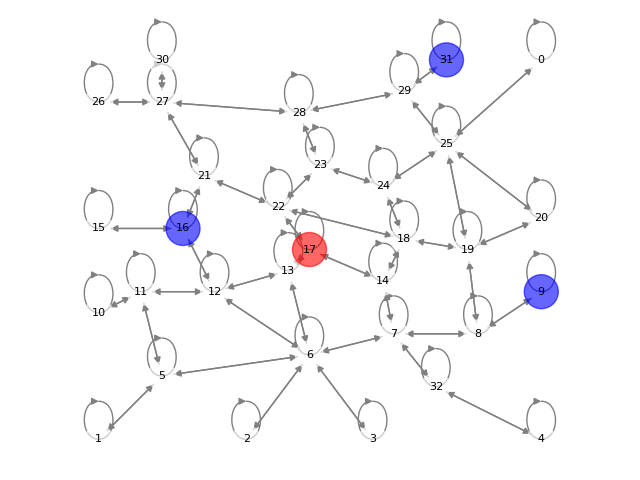

# simmodel
Simulation environment for Reinforcement Learning experiments in Search & Pursuit on Graphs.
Thesis work-in-progress for UvA/AI program

* Predicting escape routes in a passive search scenario with partial observability  

