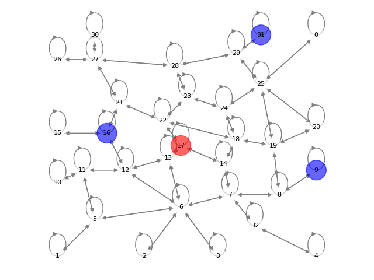
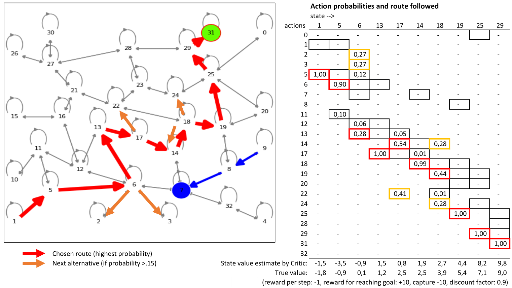
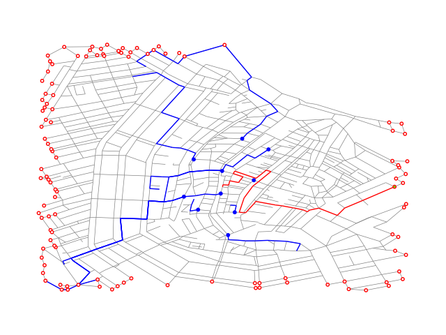
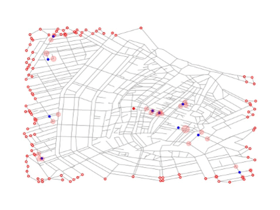

# simmodel
Simulation environment for Reinforcement Learning experiments in Search & Pursuit-Evasion on Graphs.
Thesis work `Predicting plausible escape routes using reinforcement learning and graph representations' for UvA/AI MSc program ([Thesis Proposal](modules/sim/Thesis_proposal.pdf), [Final Thesis](modules/sim/Final_thesis.pdf))

# Installation
- Clone this repo
    ```
    git clone git@github.com:rvdweerd/simmodel.git
    cd simmodel
    ```
- Create conda environment from yml file (check/adjust cudatoolkit version)
    ```
    conda env create -f environment.yml
    conda activate rl
    ```
- Use pip to install `Pytorch Geometric (check/adjust cudatoolkit version)
    ```
    pip install torch-scatter -f https://data.pyg.org/whl/torch-1.11.0+cu102.html
    pip install torch-sparse -f https://data.pyg.org/whl/torch-1.11.0+cu102.html
    pip install torch-geometric
    ```
- Install stable-baselines3 contrib
  ```
  cd ..
  git clone https://github.com/Stable-Baselines-Team/stable-baselines3-contrib/
  cd stable-baselines3-contrib
  pip install  -e .
  cd ../simmodel
  ```

# Training and testing models
- Replicate the LSTM experiment with the PPO-GNN-LSTM model (section 'Effect of LSTM positioning', Appendix E2)
    ```
    python Phase3_lstm-gnn-ppo_simp.py --train_on MemTask-U1 --train True --demoruns True --obs_mask freq --obs_rate 0.2 --lstm_type EMB
    ```
    Before training, user interaction (demoruns) with the training graphset is offered, rendered graph states are in /results/test.png
    Training tensorboard output and results are stored in /results/results_Phase3simp/
- Replicate the Scale-up experiment with the DQN-GNN model (section '6.2 Scale-up to real-world road networks')
    ```
    python Phase2b_gnn-dqn.py --train_on NWB_AMS --max_nodes 975 --qnet s2v --train True --demoruns True
    ```
    Note: to train with AMS graphs, 20GB of GPU VRAM is required. If this is not available, training can be performed on smaller graphs, e.g. 'M3M5Mix'.
    Training tensorboard output and results are stored in /results/results_Phase2/
- Replicate the baseline PPO-GNN-LSTM experiment (section '6.3 Extend to partial observability')
    ```
    python Phase3_lstm-gnn-ppo_simp.py --train_on NWB_AMS_mixed_obs --obs_mask mix --train True --demoruns True  --lstm_type EMB --lstm_hdim 64
    ```
    Note: to train with AMS graphs, 20GB of GPU VRAM is required. Training tensorboard output and results are stored in /results/results_Phase3simp/    
# Background and examples
* Goal: predicting escape routes in a passive search scenario with partial observability</br></br>


* Demo: a Graph Neural Net based policy model, trained using PPO with invalid action masking, can generalize and be applied to unseen graphs</br></br>


* Demo: escape agent traverses from Dam Square (Amsterdam) to a target node, while avoiding pursuers that move to observation positions. Escape behavior is based on graph representation learning on smaller graphs, combined with reinforcement learning using PPO</br></br>


* Demo: performance of the Collision Risk Avoidance heuristic benchmark</br></br>


* Demo: performance of GNN-LSTM model, trained using PPO under partial observability</br></br>


# Citation
```
@mastersthesis{weerd2022spe_rl,
    author = {R. van der Weerd},
    institution = {University of Amsterdam, Graduate School of Informatics},
    pages = 57,
    school = {University of Amsterdam, Graduate School of Informatics, Master's program in artificial intelligence},
    title = {Predicting plausible escape routes using reinforcement learning and graph representations},
    year = 2022
}
```
